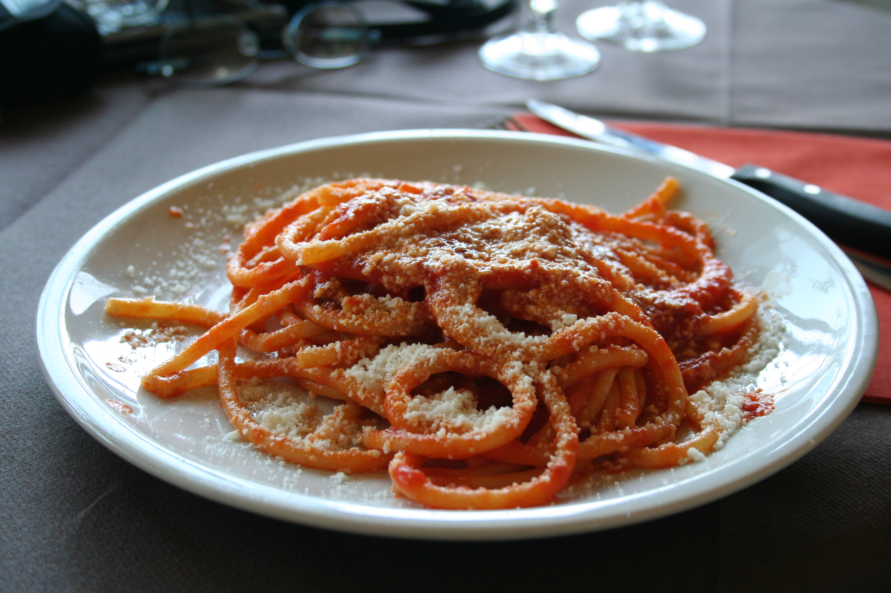

# Pasta all'amatriciana

## Intro

Pasta all'amatriciana (or "alla matriciana") is a very popular dish from Amatrice, a small town in Lazio, very close to Abruzzo.
The original name was "alla matriciana", since shepherds from Amatrice used to call themselves "matriciani", but it's become common use to call this pasta "amatriciana".
Traditionally the recipe had no tomatoes, but nowadays this is the recipe as it's eaten in Lazio.

## Ingredients (2 people)

* 200g pasta, preferably bucatini
* 125g guanciale
* 75g pecorino from Amatrice (if you can, avoid pecorino romano, as it's too strong for this recipe)
* 250g of San Marzano canned tomatoes
* 1 generous spoonful of lard
* 1 red chilli

## How to do it

Bring 2 liters of water to boil, then add 20g of salt. Cook the pasta for around 1 minute less than the time you read on the box.

In the meantime put a pan on high heat.
Put the lard in it, and once it's hot bring the heat to moderate and start cooking the chilli and the guanciale, cut into stripes of consistent size, for a couple of minutes until it's golden.
Once the guanciale is ready (not too crunchy, but the fat should render a bit), put the tomatoes in the pan and reduce it.

When the sauce reaches the thickness you like, remove the chilli and put pasta and pecorino in the pan, stirring thoroughly.

Serve straightway, finishing it off with some more grated pecorino on top if you like.

## Tips and tricks

Use lard to cook the guanciale, not olive oil as it's too acid for this recipe.

## Related

[Pasta alla carbonara](./pasta_alla_carbonara.md).

## Allergies and dietary requirements

* Nut free

## Acknowledgements

Thanks [Daniele Muscetta](http://www.flickr.com/photos/dani3l3/1268727758) for the pic (used under license).
